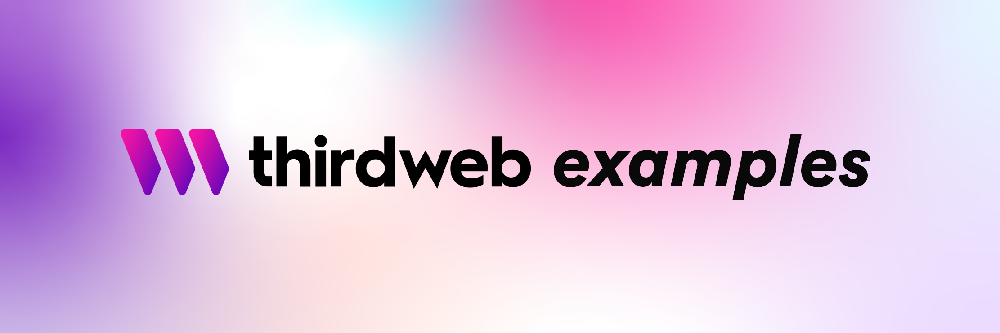

<!-- Banner Image -->

 

  

    thirdweb examples to kickstart your next project, or to learn more about using thirdweb's features!
  

 

  <a href="https://portal.thirdweb.com/">thirdweb Portal</a> •
  <a href="https://github.com/orgs/thirdweb-dev/repositories">thirdweb-dev</a> •
  <a href="https://discord.com/invite/thirdweb">Join our Discord</a>

 

## Starter Kits

### EVM

| Type           | Framework        | Language   | Example Project                                                             |
| :------------- | :--------------- | :--------- | :-------------------------------------------------------------------------- |
| Smart Contract | Hardhat          | Javascript | [Link](https://github.com/thirdweb-example/hardhat-javascript-starter)      |
| Smart Contract | Hardhat          | Typescript | [Link](https://github.com/thirdweb-example/hardhat-typescript-starter)      |
| Smart Contract | Forge            | Solidity   | [Link](https://github.com/thirdweb-example/forge-starter)                   |
| Web App        | Create React App | JavaScript | [Link](https://github.com/thirdweb-example/cra-javascript-starter)          |
| Web App        | Create React App | TypeScript | [Link](https://github.com/thirdweb-example/cra-typescript-starter)          |
| Web App        | Next.js          | JavaScript | [Link](https://github.com/thirdweb-example/next-javascript-starter)         |
| Web App        | Next.js          | TypeScript | [Link](https://github.com/thirdweb-example/next-typescript-starter)         |
| Web App        | Vite             | JavaScript | [Link](https://github.com/thirdweb-example/vite-javascript-starter)         |
| Web App        | Vite             | TypeScript | [Link](https://github.com/thirdweb-example/vite-typescript-starter)         |
| Mobile App     | React Native     | JavaScript | [Link](https://github.com/thirdweb-example/react-native-javascript-starter) |
| Mobile App     | React Native     | TypeScript | [Link](https://github.com/thirdweb-example/react-native-typescript-starter) |
| API            | Express          | JavaScript | [Link](https://github.com/thirdweb-example/express-javascript-starter)      |
| API            | Express          | TypeScript | [Link](https://github.com/thirdweb-example/express-typescript-starter)      |
| Scripting      | Node.js          | JavaScript | [Link](https://github.com/thirdweb-example/node-javascript-starter)         |
| Scripting      | Node.js          | TypeScript | [Link](https://github.com/thirdweb-example/node-typescript-starter)         |

### Solana

| Type    | Framework        | Language   | Example Project                                                               |
| :------ | :--------------- | :--------- | :---------------------------------------------------------------------------- |
| Web App | Create React App | JavaScript | [Link](https://github.com/thirdweb-example/cra-javascript-solana-starter)     |
| Web App | Create React App | TypeScript | [Link](https://github.com/thirdweb-example/cra-typescript-solana-starter)     |
| Web App | Next.js          | JavaScript | [Link](https://github.com/thirdweb-example/next-javascript-solana-starter)    |
| Web App | Next.js          | TypeScript | [Link](https://github.com/thirdweb-example/next-typescript-solana-starter)    |
| API     | Express          | JavaScript | [Link](https://github.com/thirdweb-example/express-javascript-solana-starter) |
| API     | Express          | TypeScript | [Link](https://github.com/thirdweb-example/express-typescript-solana-starter) |
| Script  | Node.js          | JavaScript | [Link](https://github.com/thirdweb-example/node-javascript-solana-starter)    |
| Script  | Node.js          | TypeScript | [Link](https://github.com/thirdweb-example/node-typescript-solana-starter)    |

